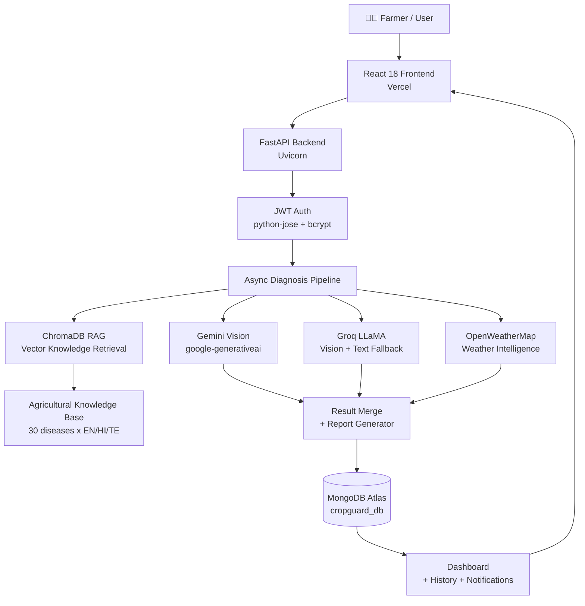

# CropGuard AI

[](https://crop-guard-liart.vercel.app)
[](https://github.com/bharatraghupatruni-ai/crop-guard)
[](https://fastapi.tiangolo.com)
[](https://react.dev)
[](https://mongodb.com)

> **CropGuard AI** is an AI-powered crop disease detection and agricultural decision-support platform built during an AI Engineer internship at Symbiosys Technologies, Visakhapatnam. It combines multimodal vision AI, ChromaDB vector knowledge retrieval, weather intelligence, and a modern full-stack architecture to help farmers detect and respond to crop diseases in real time.

---

## 🌿 Project Overview

Crop diseases cause **20–40% of global agricultural production loss** annually. Early, accurate identification is the difference between a managed outbreak and a total crop failure — yet most smallholder farmers lack access to agronomists on demand.

**CropGuard AI** solves this by:
- Accepting a single leaf photograph from a farmer
- Running it through a 4-tier AI vision pipeline (Gemini → Groq LLaMA)
- Grounding the diagnosis in a ChromaDB vector knowledge base of verified agricultural pathology data
- Returning a structured agronomist-quality report: disease name, severity, spread risk, treatment plan, and weather advisory
- Persisting everything to MongoDB and presenting a rich React dashboard

**Target users:** Smallholder farmers, agricultural extension officers, agri-tech researchers  
**Supported crops:** Tomato, Potato, Chilli, Maize, Rice, Cotton, Groundnut (Indian agricultural priority crops)

---

## ✅ Feature Status

| Feature | Status | Notes |
|---|---|---|
| Leaf image upload + AI diagnosis | ✅ Implemented | Async 10-step pipeline |
| Gemini Vision primary analysis | ✅ Implemented | gemini-2.5-flash |
| Groq LLaMA fallback (vision) | ✅ Implemented | llama-4-scout-17b |
| Groq LLaMA fallback (text) | ✅ Implemented | llama-3.3-70b |
| ChromaDB vector knowledge retrieval | ✅ Implemented | 30 diseases, 3 languages |
| Agricultural knowledge base | ✅ Implemented | EN / HI / TE |
| Weather intelligence | ✅ Implemented | OpenWeatherMap |
| Treatment recommendations (RAG) | ✅ Implemented | MongoDB-seeded |
| JWT authentication | ✅ Implemented | 7-day token |
| MongoDB persistence | ✅ Implemented | Motor async driver |
| Scan history + delete | ✅ Implemented | |
| Dashboard analytics | ✅ Implemented | |
| Multilingual UI | ✅ Implemented | English, Hindi, Telugu |
| Admin panel | ✅ Implemented | User + scan management |
| Notifications | ✅ Implemented | Per-scan push to inbox |
| MobileNetV3 local model | ⚗️ Experimental | Research module, no weights shipped |
| Research feedback pipeline | ⚗️ Experimental | For model improvement |

---

## 🏗️ System Architecture



---

## 🤖 AI Architecture

### Primary: Google Gemini Vision
Gemini 2.5 Flash receives the preprocessed leaf image alongside a structured clinical pathology prompt. The prompt includes:
1. The crop type and list of possible diseases
2. **ChromaDB-retrieved** verified agricultural knowledge context for the crop
3. A structured JSON output schema ensuring consistent, parseable reports

### ChromaDB RAG Pipeline

```
Agricultural Knowledge Base (30 diseases)
         ↓
  Text serialisation (EN symptoms + causes + treatments)
         ↓
  ChromaDB default embedding function (sentence-transformers)
         ↓
  Persistent local vector store (cosine similarity)
         ↓
  Query: crop + disease candidate → top-3 semantic matches
         ↓
  Retrieved context injected into Gemini / Groq prompt
         ↓
  Grounded AI Diagnosis
```

The ChromaDB collection is seeded on startup and persisted to disk. If ChromaDB is unavailable, the system falls back to exact-key lookup from the knowledge base — **zero accuracy loss**.

### Fallback Chain (4-tier)

| Tier | Model | Provider |
|---|---|---|
| 1 | gemini-2.5-flash | Google AI Studio |
| 2 | gemini-2.5-flash-lite | Google AI Studio |
| 3 | llama-4-scout-17b-16e-instruct (vision) | Groq |
| 4 | llama-3.3-70b-versatile (text) | Groq |
| 5 | Smart local random fallback | — |

> **Note on Groq:** Groq is an inference platform, not a model. The models are Meta's LLaMA family, served at ultra-low latency via Groq's LPU infrastructure.

### MobileNetV3 (Experimental Research Module)

A custom MobileNetV3-Large model (`backend/ml/`) was trained on 38 disease classes as part of research into on-device inference. Key facts:
- **Does NOT affect the main diagnosis pipeline** — runs in the background only
- Model weights are **not shipped** in this repository (train via `ml/train.py`)
- Used to populate the "Research Lab" experimental UI panel
- Results are labelled "Demo Mode" when weights are absent (expected behaviour)
- Accuracy on controlled datasets is not representative of real-world farm conditions

---

## 📋 Complete Application Flow

```
1. User registers / logs in → JWT token issued (7-day expiry)
2. User selects crop type + uploads leaf image
3. React POSTs to POST /api/v1/diagnose/ → job_id returned instantly
4. FastAPI starts background pipeline:
   ├─ Image compression (PIL → max 1024px)
   ├─ ChromaDB RAG retrieval (semantic knowledge context)
   ├─ Gemini Vision analysis (with RAG-grounded prompt)
   │   └─ Falls back: Gemini Lite → Groq Vision → Groq Text → Local
   ├─ OpenWeatherMap weather fetch (parallel with AI)
   ├─ MongoDB treatment lookup (RAG-matched)
   ├─ Report assembly + severity scoring
   └─ MongoDB scan persistence + notification insert
5. Frontend polls GET /api/v1/diagnose/status/{job_id} every 1 second
6. On completion: animated 10-step timeline resolves, report renders
7. Report sections: Summary → Observations → Differential Diagnosis →
   Disease Education → Treatment Plan → Weather Advisory → Agronomist Recommendations
8. Scan saved to history; user can review, delete, or re-view any time
```

---

## 🛠️ Tech Stack

| Layer | Technology | Purpose |
|---|---|---|
| **Frontend** | React 18 + Vite + Tailwind CSS | SPA dashboard |
| **UI Animation** | Framer Motion | Diagnosis timeline animations |
| **Charts** | Recharts | Dashboard analytics |
| **HTTP Client** | Axios | API communication |
| **Backend** | FastAPI + Uvicorn | Async REST API |
| **Database** | MongoDB Atlas (Motor) | Async document storage |
| **Auth** | python-jose (JWT) + passlib (bcrypt) | Stateless authentication |
| **AI Vision** | Google Gemini 2.5 Flash | Primary multimodal diagnosis |
| **AI Fallback** | Groq + Meta LLaMA | High-speed inference fallback |
| **Vector RAG** | ChromaDB (persistent) | Semantic knowledge retrieval |
| **Knowledge Base** | Python dict → ChromaDB | 30 diseases x EN/HI/TE |
| **Weather** | OpenWeatherMap API | Real-time agricultural advisories |
| **Frontend Deploy** | Vercel | CDN + edge deployment |

---

## 📁 Project Structure

```
crop-guard/
├── backend/
│   ├── app/
│   │   ├── main.py              # FastAPI app + startup
│   │   ├── config.py            # Pydantic settings (env-driven)
│   │   ├── auth.py              # JWT + bcrypt helpers
│   │   ├── database.py          # Motor async MongoDB + seed
│   │   ├── routers/
│   │   │   ├── auth.py          # Register / Login / Me
│   │   │   ├── diagnose.py      # Async diagnosis pipeline
│   │   │   ├── scans.py         # Scan CRUD + history
│   │   │   ├── treatments.py    # Treatment library
│   │   │   ├── weather.py       # OpenWeatherMap integration
│   │   │   ├── analytics.py     # Dashboard statistics
│   │   │   ├── admin.py         # Admin user/scan management
│   │   │   ├── notifications.py # User notification inbox
│   │   │   └── research_feedback.py  # MobileNet feedback loop
│   │   └── services/
│   │       ├── prediction.py    # AI prediction engine (4-tier)
│   │       ├── rag.py           # ChromaDB vector retrieval
│   │       ├── knowledge_base.py # Agricultural knowledge (164KB)
│   │       ├── model_trainer.py # Training orchestration
│   │       └── translator.py    # EN/HI/TE localisation
│   ├── ml/
│   │   ├── model.py             # MobileNetV3 architecture
│   │   ├── train.py             # Training pipeline
│   │   ├── inference.py         # Local inference (experimental)
│   │   ├── evaluate.py          # Model evaluation
│   │   └── labels.json          # 38 class label map
│   ├── translations/            # Backend i18n (EN/HI/TE)
│   ├── uploads/                 # Uploaded leaf images (gitignored)
│   ├── requirements.txt
│   └── .env.example
├── frontend/
│   ├── src/
│   │   ├── pages/               # ScanPage, Dashboard, History, Admin...
│   │   ├── components/          # Shared UI components
│   │   ├── api/index.js         # Typed API client (Axios)
│   │   ├── context/             # Auth + Language context
│   │   └── translations/        # Frontend i18n (EN/HI/TE)
│   ├── package.json
│   └── vite.config.js
├── README.md
├── .gitignore
├── setup.bat                    # One-click local setup
└── START-APP.bat                # One-click local start
```

---

## 🔌 API Reference

All endpoints are prefixed with `/api/v1`. Authentication requires `Authorization: Bearer <token>`.

### Authentication
| Method | Endpoint | Auth | Description |
|---|---|---|---|
| `POST` | `/auth/register` | ❌ | Create account |
| `POST` | `/auth/login` | ❌ | Obtain JWT token |
| `GET` | `/auth/me` | ✅ | Current user info |

### Diagnosis
| Method | Endpoint | Auth | Description |
|---|---|---|---|
| `POST` | `/diagnose/` | ✅ | Start async diagnosis job; returns `job_id` |
| `GET` | `/diagnose/status/{job_id}` | ✅ | Poll job status and result |

**POST `/diagnose/`** — multipart form:
```
image    : file (JPG/PNG/WEBP, max 10MB)
crop     : string (Tomato|Potato|Chilli|Maize|Rice|Cotton|Groundnut)
field    : string (optional field/location name)
language : string (en|hi|te, default: en)
```

### Scans
| Method | Endpoint | Auth | Description |
|---|---|---|---|
| `GET` | `/scans/` | ✅ | List user's scans (paginated) |
| `GET` | `/scans/{id}` | ✅ | Get single scan |
| `DELETE` | `/scans/{id}` | ✅ | Delete scan + image file |

### Other Endpoints
| Method | Endpoint | Auth | Description |
|---|---|---|---|
| `GET` | `/treatments/` | ✅ | Treatment library |
| `GET` | `/treatments/disease/{name}` | ✅ | Treatment by disease name |
| `GET` | `/weather/current` | ✅ | Live weather |
| `GET` | `/weather/advisory` | ✅ | Weather-crop advisory |
| `GET` | `/analytics/dashboard` | ✅ | Dashboard statistics |
| `GET` | `/health` | ❌ | Health check |
| `GET` | `/docs` | ❌ | Swagger UI |

---

## 🚀 Local Setup

### Prerequisites
- Python 3.11+
- Node.js 20+ (LTS)
- MongoDB (local Community or Atlas free tier)

### 1. Clone
```bash
git clone https://github.com/bharatraghupatruni-ai/crop-guard.git
cd crop-guard
```

### 2. Backend
```bash
cd backend
pip install -r requirements.txt
cp .env.example .env
# Edit .env — set GEMINI_API_KEY, GROQ_API_KEY, OPENWEATHER_API_KEY, MONGO_URL
uvicorn app.main:app --reload --port 8000
```

### 3. Frontend
```bash
cd frontend
npm install
npm run dev
# App: http://localhost:5173
# API Docs: http://localhost:8000/docs
```

### Quick Start (Windows)
```
Double-click setup.bat      # First-time install
Double-click START-APP.bat  # Every subsequent run
```

---

## ⚙️ Environment Variables

See [`backend/.env.example`](backend/.env.example) for a full annotated template.

| Variable | Required | Description |
|---|---|---|
| `MONGO_URL` | ✅ | MongoDB Atlas connection string |
| `SECRET_KEY` | ✅ | JWT signing secret (min 32 chars) |
| `GEMINI_API_KEY` | ✅ | Google AI Studio API key |
| `GROQ_API_KEY` | ✅ | Groq console API key |
| `OPENWEATHER_API_KEY` | ✅ | OpenWeatherMap API key |
| `APP_ENV` | ✅ | `development` or `production` |
| `ALLOWED_ORIGINS` | ✅ | Comma-separated CORS origins |

---

## 🌐 Deployment

### Live

| Service | URL |
|---|---|
| **Frontend** | https://crop-guard-liart.vercel.app |
| **API Docs** | https://crop-guard-liart.vercel.app *(backend connected via Vercel)* |

> **Note:** AI functionality requires properly configured environment variables (`GEMINI_API_KEY`, `GROQ_API_KEY`, `OPENWEATHER_API_KEY`, `MONGO_URL`) on the deployment platform.

---

## 🔒 Security

- API keys stored exclusively in environment variables — never in source code
- JWT secret loaded from env; startup guard blocks deployment with default values in production
- MongoDB credentials not committed; Atlas connection string is env-only
- `.env` files are gitignored; only `.env.example` (placeholders) is committed
- Passwords hashed with bcrypt (cost factor 12)
- Default admin account (`admin@cropguard.ai`) seeded on first DB init — **change password immediately after first login**
- File uploads validated by MIME type and limited to 10MB
- CORS explicitly configured via `ALLOWED_ORIGINS` env var

---

## 👤 Author

**Bharat Raghupatruni**  
AI Engineer Intern — Symbiosys Technologies, Visakhapatnam  
[GitHub](https://github.com/bharatraghupatruni-ai)
